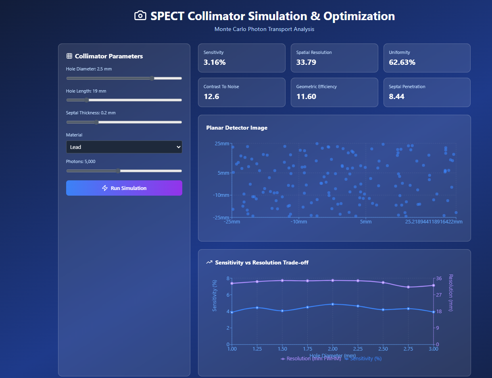

#  SPECT Collimator Monte Carlo Simulation Dashboard

This project simulates **gamma photon transport and collimator response** in a **SPECT (Single Photon Emission Computed Tomography)** system. It was designed as a portfolio project to demonstrate nuclear imaging hardware engineering, detector response modeling, and collimator optimization concepts.

---

## Purpose

This simulation models photon–collimator interactions to estimate:
- **Spatial resolution** and **sensitivity trade-offs**.
- The effects of **hole geometry, septal thickness, and material** on image quality.
- Photon path behavior using simplified **Monte Carlo methods**.

Developed using **React + Recharts + TailwindCSS**, this tool provides an interactive and visually intuitive interface for:
- Adjusting **collimator design parameters**.
- Running photon transport simulations.
- Visualizing **energy spectra** and **collimator performance metrics**.

---

## Features

-  Adjustable parameters for hole size, thickness, and photon energy.  
-  Real-time plots for photon detection and energy distribution.  
-  Basic Monte Carlo randomization for photon angle and absorption events.  
-  Collimator schematic and simulated data visualization.  

---

##  Technologies Used

- **React.js** – UI framework  
- **Recharts** – Interactive plots  
- **TailwindCSS** – Styling  
- **Lucide-react** – Icons  
- **Monte Carlo Simulation** – Random photon propagation model  

---

## 📸 Simulation Preview

!

---

##  Run Locally

1. Clone the repository:
   ```bash
   git clone https://github.com/abrahamgenetu/spect-collimator-sim.git
   cd spect-collimator-sim
